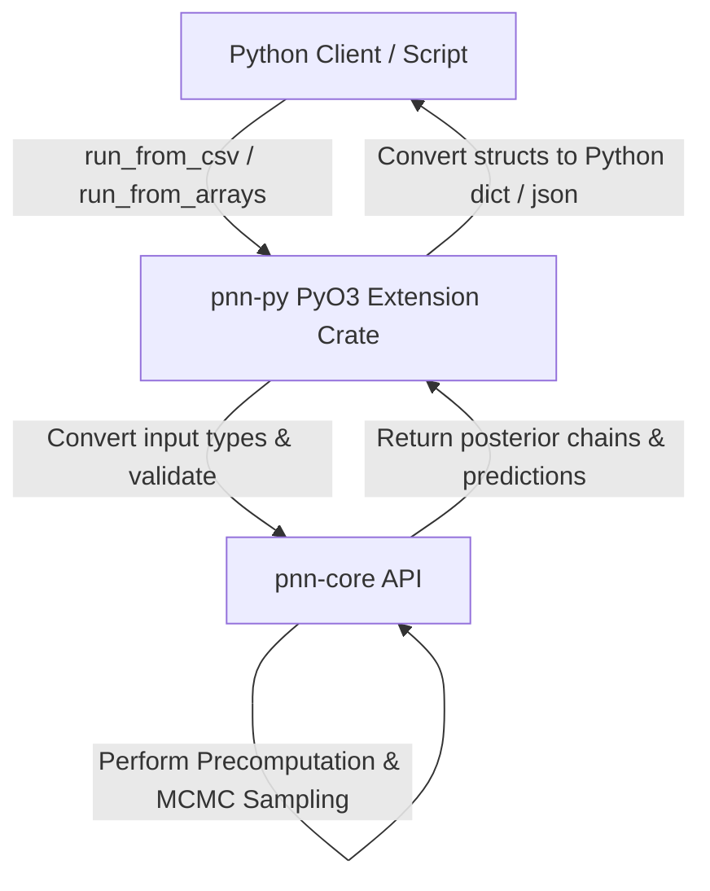

# Python Bindings & PyO3/Maturin Compilation Guide


One of the main issues i faced when developing the Rust implementation was how to expose it to Python users in a way that is both efficient and user-friendly. Here i describe what is the usage of the Python bindings for this implementation, detailing how they are structured, compiled using PyO3 and Maturin, and run using the Pixi developer environment.
This is just an experimental approach of exposing both zig and rust implementation to python.
for the case of Rust we compiled using PyO3 and Maturin, optimized with Global Interpreter Lock (GIL) release, self-documented via PyO3 docstrings, and run using the Pixi developer environment.

---

## Architecture Overview

The Python bindings are implemented in the `pnn-py` crate located at [rust/pnn-py/](file:///Users/jmontana/Documents/bayezier/rust/pnn-py/). This crate acts as an interface between the optimized Rust core library [pnn-core](file:///Users/jmontana/Documents/bayezier/rust/pnn-core/) and Python environments.



---

## PyO3 & Maturin Compilation

The project uses [PyO3](https://pyo3.rs/) to write native Python extension modules in Rust and [Maturin](https://github.com/PyO3/maturin) to build and publish them.

### Crate Configuration
In [rust/pnn-py/Cargo.toml](file:///Users/jmontana/Documents/bayezier/rust/pnn-py/Cargo.toml), the crate is configured as a dynamic system library:
```toml
[lib]
name = "pnn_py"
crate-type = ["cdylib", "rlib"]

[dependencies]
pnn-core = { path = "../pnn-core" }
csv = "1.3"
serde = { version = "1.0", features = ["derive"] }
serde_json = "1.0"
pyo3 = { version = "0.22" }
```
- `crate-type = ["cdylib"]` is required to produce a shared library (`.so`, `.dylib`, or `.pyd`) that Python can import.
- `[package.metadata.maturin]` specifies metadata like the library name `pnn_py` for Maturin packaging.

### Build and Environment Management with Pixi
Compilation and environment setup are managed via [pixi.toml](file:///Users/jmontana/Documents/bayezier/pixi.toml). When compiling, Maturin interacts with `uv` (a fast Python package installer and resolver) to compile and install the module directly inside the virtual environment.

Building the extension:
```bash
pixi run -e dev py-build
```
This runs:
```bash
maturin develop --manifest-path rust/pnn-py/Cargo.toml --uv --features extension-module
```
- `maturin develop` builds the crate and installs the resulting module directly into the active Python virtual environment.
- The `--uv` flag speeds up the package resolution and installation.
- The `extension-module` feature in PyO3 avoids linking against the python library directly during building (which is required on macOS and Linux to avoid link errors).

---

## Performance & Usability Optimizations

### 1. Global Interpreter Lock (GIL) Release
For high performance, computational sampler execution runs off-GIL. Python's GIL is released using `py.allow_threads(...)` before entering the core MCMC sampling loop:
- **Parallel Execution**: Allows multi-threaded Python applications (e.g., executing multiple chains using `ThreadPoolExecutor`) to run concurrently without blocking.
- **Minimal Overhead**: Input data conversions from Python arrays/sequences to native Rust types are performed while holding the GIL, and the GIL is only released for CPU-intensive computations.

### 2. Embedded Docstrings
Both APIs are fully self-documenting. PyO3 docstrings are compiled directly into the binary module. Calling `help(pnn_py.run_from_csv)` or using autocompletion in Jupyter/VS Code displays parameter documentation, defaults, and return schemas directly.

---

## API Specifications

Two primary API entrypoints are exposed via the `pnn_py` module:

### 1. `run_from_csv`
Runs the complete Bayesian k-NN inference using input CSV files. It mirrors the configuration options and validations found in the CLI application.

#### Function Signature:
```python
pnn_py.run_from_csv(
    train_path: str,
    test_path: str,
    dataset: str = "unknown",
    implementation: str = "rust",
    k: int | None = None,
    k_values: list[int] | None = None,
    k_range: tuple[int, int] | None = None,
    method: str = "hybrid",
    n_samples: int = 1000,
    burn_in: int = 500,
    thinning: int = 1,
    beta_step: float = 0.3,
    beta_sigma: float = 5.0,
    seed: int | None = None,
    out_path: str | None = None,
    diagnose_path: str | None = None
) -> dict
```

---

### 2. `run_from_arrays`
Runs the Bayesian k-NN inference completely in-memory using sequence inputs, bypassing file I/O. It accepts standard Python nested lists, tuples, or NumPy arrays (via `.tolist()` fallbacks).

#### Function Signature:
```python
pnn_py.run_from_arrays(
    x_train: Any,  # 2D numeric array/list (n_samples x n_features)
    y_train: Any,  # 1D integer label array/list
    x_test: Any,   # 2D numeric array/list (n_test_samples x n_features)
    y_test: Any | None = None,  # Optional 1D integer label array/list
    dataset: str = "unknown",
    implementation: str = "rust",
    k: int | None = None,
    k_values: list[int] | None = None,
    k_range: tuple[int, int] | None = None,
    method: str = "hybrid",
    n_samples: int = 1000,
    burn_in: int = 500,
    thinning: int = 1,
    beta_step: float = 0.3,
    beta_sigma: float = 5.0,
    seed: int | None = None,
    out_path: str | None = None,
    diagnose_path: str | None = None
) -> dict
```
If `y_test` is not provided, the misclassification cost is returned as `0.0`.

---

## Return Payload Schema

Both functions return a Python dictionary with the following schema:
```json
{
  "implementation": "rust",
  "dataset": "sample",
  "predictions": [
    {
      "index": 0,
      "probabilities": [0.75, 0.25],
      "predicted_class": 0
    }
  ],
  "k_posterior": [3, 3, 5, 3, ...],
  "beta_posterior": [0.42, 0.38, 0.51, ...],
  "misclassification_cost": 0.125,
  "runtime_ms": 23.45
}
```

---

## Core Refactoring Details

To ensure consistency between the CSV and in-memory workflows, the pipeline was refactored. The core logic is structured around three main phases:

1. **Input Parsing & Validation**:
   - For `run_from_csv`, the CSVs are parsed using Rust's `csv` crate and validated to ensure column headers align (with the last column named `label`), features parse as `f64`, and labels parse as `usize`.
   - For `run_from_arrays`, dynamic objects are extracted to `Vec<Vec<f64>>` and `Vec<usize>` using PyO3 extraction with fallbacks to invoke `.tolist()` on NumPy arrays.
   - Sampling parameters (`n_samples >= 1`, `thinning >= 1`, `beta_step > 0`, `beta_sigma > 0`, and positive `k`/`k_values`/`k_range`) are validated.
   
2. **Shared Inference Pipeline (`run_model`)**:
   - Both workflows compile their configuration into `RunConfig` and forward the training arrays to the shared `run_model` function in [rust/pnn-py/src/lib.rs](file:///Users/jmontana/Documents/bayezier/rust/pnn-py/src/lib.rs).
   - Candidate values of `k` are resolved and clamped to `[1, n_train - 1]`.
   - Instantiates a `PnnModel` and executes `sample_posterior` using `pnn-core` components.
   - Predicts class probabilities with `predict_proba` and calculates `misclassification_cost`.

3. **Output Export**:
   - If `out_path` is specified, writes the benchmark JSON structure.
   - If `diagnose_path` is specified, writes diagnostic metrics using `build_diagnostics` (autocorrelation, ESS, accept rates).

---

## Python Benchmark Scripts

### 1. CSV-based Benchmark Runner (`run_rust_py.py`)
The script [benchmarks/run_rust_py.py](file:///Users/jmontana/Documents/bayezier/benchmarks/run_rust_py.py) wraps `run_from_csv` and prints a summary.

#### Running with Pixi:
A Pixi task `py-benchmark` is registered in `pixi.toml` to execute this script directly:
```bash
pixi run -e dev py-benchmark
```

Or execute it manually:
```bash
pixi run -e dev python benchmarks/run_rust_py.py \
  --train data/sample_train.csv \
  --test data/sample_test.csv \
  --out benchmarks/out/rust_py.json \
  --dataset sample \
  --k-range 1 5 \
  --n-samples 200 \
  --burn-in 50 \
  --seed 42
```

---

### 2. Array-based Benchmark Runner (`run_rust_py_arrays.py`)
The script [benchmarks/run_rust_py_arrays.py](file:///Users/jmontana/Documents/bayezier/benchmarks/run_rust_py_arrays.py) loads features and labels from CSV files into memory, constructs native list or NumPy matrices, and calls `run_from_arrays(...)`.

Features:
- **Default Mode**: Uses Python lists for representation.
- **NumPy Mode**: If the `--use-numpy` flag is set, converts features and labels into NumPy matrices. *Note: NumPy is not pre-installed in the default Pixi environment and requires installation to run this mode.*
- **Out & Parity Outputs**: Writes results JSON using `--out`, and optionally writes a verification file via `--parity-out`.

#### Running with Pixi:
A Pixi task `py-benchmark-arrays` is registered in `pixi.toml` to run this:
```bash
pixi run -e dev py-benchmark-arrays
```

Or execute it manually:
```bash
pixi run -e dev python benchmarks/run_rust_py_arrays.py \
  --train data/sample_train.csv \
  --test data/sample_test.csv \
  --parity-out benchmarks/out/rust_py_arrays_parity.json \
  --dataset sample \
  --implementation rust-py-arrays \
  --k 3 \
  --n-samples 50 \
  --burn-in 10 \
  --seed 1
```

---

### 3. Multi-Dataset Evaluation Script (`run_evaluation.py`)
The script [benchmarks/run_evaluation.py](file:///Users/jmontana/Documents/bayezier/benchmarks/run_evaluation.py) runs the model across all six standard datasets under [data/](file:///Users/jmontana/Documents/bayezier/data/) (Cushings, Viruses, Crabs, Glass, Pima, and Synthetic Ripley).

This script uses `pnn_py.run_from_arrays` in memory and generates a summary Markdown report:
- Automatically saves outputs to `benchmarks/out/<dataset>_eval_rust_py.json` and diagnostics files.
- Generates `benchmarks/evaluation_report.md` with dataset sizes, testing accuracies, mean posterior parameters ($k$ and $\beta$), and runtimes.

#### Running with Pixi:
```bash
pixi run -e dev py-evaluation
```
